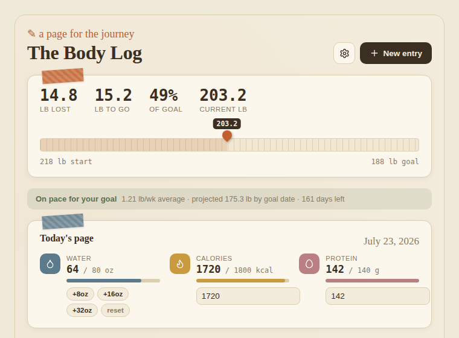
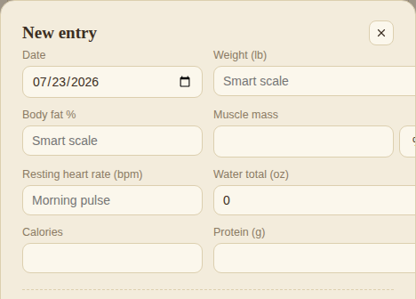
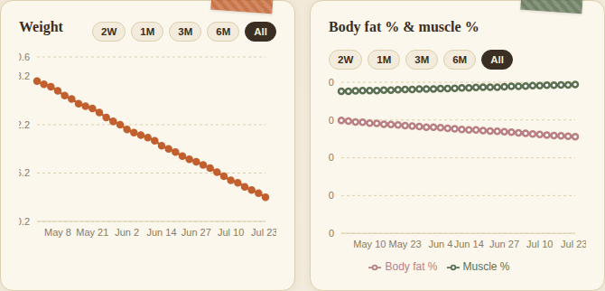
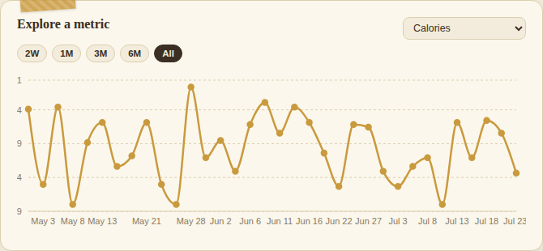
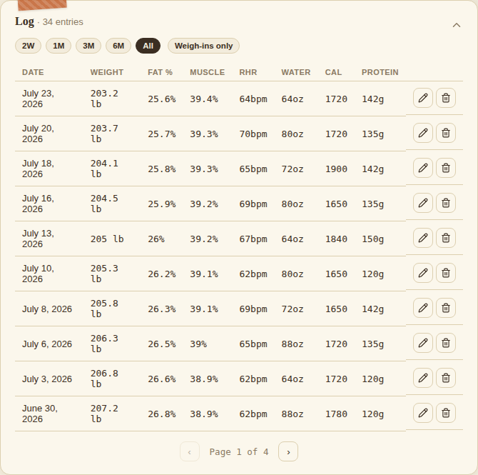
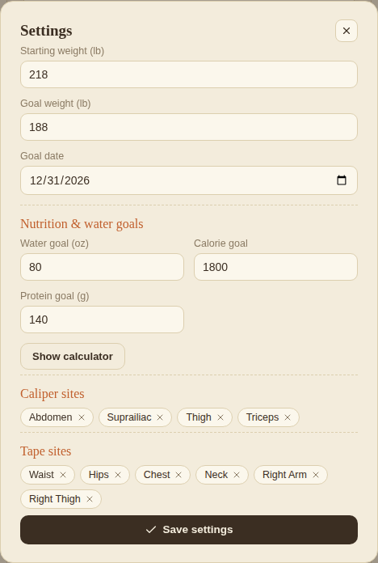
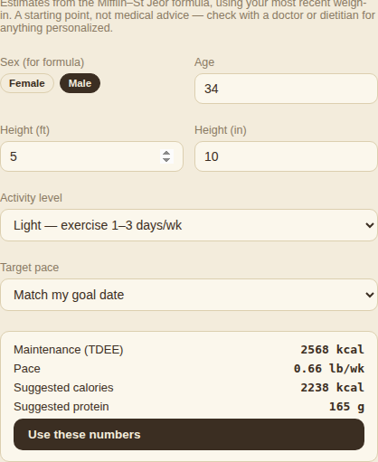

[README.md](https://github.com/user-attachments/files/30307430/README.md)
# The Body Log

A private, offline-friendly body composition, measurement, and nutrition tracker. Log weigh-ins from a smart scale, tape measurements, calipers, water, calories, and protein — all in one page you can install to your phone's home screen like an app.

All your data stays in your browser on your device. Nothing is uploaded anywhere.

## Setting it up

1. **Get a live web address for this page.** GitHub Pages (what's hosting this repo) already does this for you — once Pages is turned on for this repository, your page is live at:
   `https://YOUR-USERNAME.github.io/REPO-NAME/`
   *(If you're reading this on that page already, you're set — skip to step 2.)*
2. **Open that address on your phone** in Safari (iPhone) or Chrome (Android).
3. **Add it to your home screen:**
   - **iPhone:** tap the Share icon → **Add to Home Screen**.
   - **Android:** tap the menu (⋮) → **Add to Home screen** / **Install app**.
4. It now opens full-screen from an icon on your phone, just like a regular app — no browser bar, works offline.

> **Note:** a downloaded copy of this file opened directly from your Files app won't work — recent iOS blocks local files from running JavaScript. It has to be opened as a real web page (step 2 above) for everything to function.

## Using the app

### Set your goal
The first time you open it, you'll be asked for your starting weight, goal weight, and goal date. This sets the ends of the progress bar at the top and drives the "on pace / behind pace" indicator. You can change any of this later in Settings (⚙).

### Logging a weigh-in
Tap **+ New entry** to log weight, body fat %, muscle mass, resting heart rate, water, calories, and protein for a given day.

Scroll down in that same form for tape and caliper measurements — you can add your own custom measurement sites (e.g. a specific muscle group) right there.

### Today's page
The card near the top is for things you log more than once a day — tap +8oz / +16oz / +32oz for water as you drink through the day, and type in running totals for calories and protein from whatever you use to track food.

### Charts
**Weight** and **Body fat % & muscle %** each have their own time-range filter (2W / 1M / 3M / 6M / All), independent of each other — zoom into a recent window without affecting the other chart.

**Explore a metric** lets you pick any tracked value — water, calories, protein, resting heart rate, or any tape/caliper site — and see it plotted over time, with its own range filter too.

### Log
A collapsible, paginated table of every entry. Filter by time range or toggle **Weigh-ins only** to hide days where you only logged nutrition. Tap the pencil to edit a past entry, or the trash icon to delete one.

### Settings & the macro calculator
Tap ⚙ to set your water/calorie/protein goals, manage your measurement sites, and back up your data.

Don't know what your calorie/protein targets should be? Tap **Show calculator** — enter your sex, age, height, and activity level, and it'll estimate your maintenance calories and a suggested target based on your goal weight and date (Mifflin–St Jeor formula). This is a general estimate, not medical advice — check with a doctor or dietitian for anything personalized.

## Moving your data / backing it up

Your data lives only in this browser on this device — there's no account or sync. **Backup & transfer** (in Settings) is how you move it or save a copy. It walks you through it with three steps, but here's what's actually happening if you want the details:

1. Your entire history — goals, entries, everything — gets turned into a block of text (in a format called JSON, but you don't need to understand it).
2. Tap **Copy** to copy that text.
3. Open the app wherever you want that data (a new phone, a different browser, etc.), open Settings → Backup & transfer, paste the text into the **Paste your backup here** box, and tap **Import**.

A few things worth knowing:
- **Don't edit the copied text by hand.** If it gets cut off or altered, Import will tell you it doesn't look right rather than silently losing data.
- **Importing replaces your current data on that device** with whatever you paste — so if you've already logged entries there, back those up first too if you don't want to lose them.
- This text is also just a plain backup — you can paste it into a notes app or email it to yourself to keep a copy somewhere safe, even if you never plan to move devices.

## Data & privacy

Everything is stored locally in your browser's storage — there's no server, account, or sync. If you clear your browser data or switch browsers/devices, you'll need to use Backup & transfer first or your history will be gone.
